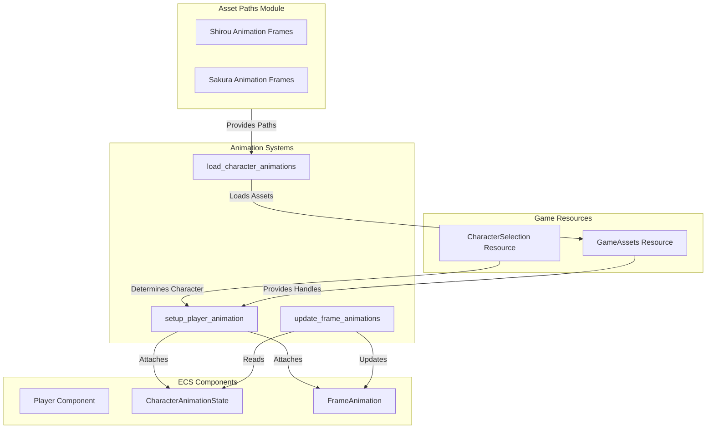

# Design Document: Character Animation System

## Overview

角色動畫系統負責管理 Shirou Runner 遊戲中 1P 和 2P 玩家的角色動畫資源。系統基於 Bevy ECS 架構，通過組件和資源管理角色的動畫幀序列，並提供統一的接口供遊戲邏輯調用。

核心設計理念：
- **資源集中管理**: 所有動畫幀路徑在 `asset_paths.rs` 中集中定義
- **玩家角色映射**: 1P 自動使用 Shirou 動畫，2P 自動使用 Sakura 動畫
- **類型安全**: 使用 Rust 類型系統確保動畫資源的正確性
- **可擴展性**: 支持未來添加更多角色和動畫狀態

## Architecture

### System Architecture



### Module Structure

```
src/
├── asset_paths.rs              # 資源路徑常量定義
├── components/
│   ├── animation.rs            # 動畫組件定義
│   └── player.rs               # 玩家組件定義
├── resources.rs                # 遊戲資源定義
└── systems/
    ├── frame_animation.rs      # 幀動畫系統
    └── setup.rs                # 初始化系統
```

## Components and Interfaces

### 1. Asset Path Constants

**Location**: `src/asset_paths.rs`

```rust
// Shirou 動畫幀路徑常量
pub const IMAGE_CHAR_SHIROU_IDLE1: &str = "images/characters/shirou_idle1.jpg";
pub const IMAGE_CHAR_SHIROU_IDLE2: &str = "images/characters/shirou_idle2.jpg";
// ... 更多幀

// Shirou 動畫幀數組
pub const SHIROU_ANIMATION_FRAMES: &[&str] = &[
    IMAGE_CHAR_SHIROU_IDLE1,
    IMAGE_CHAR_SHIROU_IDLE2,
    // ...
];

// Sakura 動畫幀路徑常量
pub const IMAGE_CHAR_SAKURA_IDLE01: &str = "images/characters/sakura_idle01.png";
// ... 更多幀

// Sakura 動畫幀數組
pub const SAKURA_ANIMATION_FRAMES: &[&str] = &[
    IMAGE_CHAR_SAKURA_IDLE01,
    // ...
];
```

**Interface**:
- `SHIROU_ANIMATION_FRAMES: &[&str]` - 返回 Shirou 所有動畫幀路徑
- `SAKURA_ANIMATION_FRAMES: &[&str]` - 返回 Sakura 所有動畫幀路徑

### 2. CharacterType Enum

**Location**: `src/states.rs` (已存在)

```rust
#[derive(Debug, Clone, Copy, PartialEq, Eq)]
pub enum CharacterType {
    Shirou1,  // 1P - Shirou
    Shirou2,  // 2P - Sakura (命名保持向後兼容)
}
```

**Methods**:
```rust
impl CharacterType {
    /// 獲取角色的動畫幀路徑數組
    pub fn get_animation_frames(&self) -> &'static [&'static str] {
        match self {
            CharacterType::Shirou1 => asset_paths::SHIROU_ANIMATION_FRAMES,
            CharacterType::Shirou2 => asset_paths::SAKURA_ANIMATION_FRAMES,
        }
    }
    
    /// 獲取角色的紋理路徑（指定幀索引）
    pub fn get_texture_path(&self, frame_index: usize) -> &'static str {
        let frames = self.get_animation_frames();
        frames.get(frame_index).copied().unwrap_or(frames[0])
    }
}
```

### 3. FrameAnimation Component

**Location**: `src/systems/frame_animation.rs` (已存在，需擴展)

```rust
#[derive(Component, Debug)]
pub struct FrameAnimation {
    pub frames: Vec<Handle<Image>>,
    pub current_frame: usize,
    pub timer: Timer,
    pub is_playing: bool,
    pub loop_animation: bool,
}
```

**Methods**:
```rust
impl FrameAnimation {
    /// 獲取當前幀的紋理句柄
    pub fn get_current_texture(&self) -> Option<Handle<Image>> {
        self.frames.get(self.current_frame).cloned()
    }
    
    /// 獲取當前幀索引
    pub fn get_current_frame_index(&self) -> usize {
        self.current_frame
    }
}
```

### 4. CharacterAnimationState Component

**Location**: `src/systems/frame_animation.rs` (已存在)

```rust
#[derive(Component, Debug, Clone)]
pub struct CharacterAnimationState {
    pub current_animation: CharacterAnimationType,
    pub idle_frames: Vec<Handle<Image>>,
    pub running_frames: Vec<Handle<Image>>,
    pub jumping_frames: Vec<Handle<Image>>,
    pub crouching_frames: Vec<Handle<Image>>,
}
```

### 5. PlayerNumber Component (新增)

**Location**: `src/components/player.rs`

```rust
/// 玩家編號組件
/// 
/// 用於區分 1P 和 2P 玩家
#[derive(Component, Debug, Clone, Copy, PartialEq, Eq)]
pub enum PlayerNumber {
    Player1,  // 1P - 使用 Shirou
    Player2,  // 2P - 使用 Sakura
}

impl PlayerNumber {
    /// 獲取對應的角色類型
    pub fn to_character_type(&self) -> CharacterType {
        match self {
            PlayerNumber::Player1 => CharacterType::Shirou1,
            PlayerNumber::Player2 => CharacterType::Shirou2,
        }
    }
}
```

## Data Models

### Animation Frame Data Structure

```rust
/// 角色動畫數據
pub struct CharacterAnimationData {
    /// 角色名稱 ("shirou" 或 "sakura")
    pub character_name: String,
    
    /// 動畫幀路徑列表
    pub frame_paths: Vec<String>,
    
    /// 動畫幀句柄（運行時加載）
    pub frame_handles: Vec<Handle<Image>>,
}
```

### Player-Character Mapping

```
1P (PlayerNumber::Player1) -> CharacterType::Shirou1 -> SHIROU_ANIMATION_FRAMES
2P (PlayerNumber::Player2) -> CharacterType::Shirou2 -> SAKURA_ANIMATION_FRAMES
```

## Implementation Details

### 1. Asset Loading System

**System**: `load_character_animations`

**Responsibility**: 在遊戲啟動時加載所有角色動畫幀

**Implementation**:
```rust
pub fn load_character_animations(
    asset_server: Res<AssetServer>,
    mut game_assets: ResMut<GameAssets>,
) {
    // 加載 Shirou 動畫幀
    game_assets.shirou_animation_frames = asset_paths::SHIROU_ANIMATION_FRAMES
        .iter()
        .map(|path| asset_server.load(*path))
        .collect();
    
    // 加載 Sakura 動畫幀
    game_assets.sakura_animation_frames = asset_paths::SAKURA_ANIMATION_FRAMES
        .iter()
        .map(|path| asset_server.load(*path))
        .collect();
}
```

### 2. Player Animation Setup System

**System**: `setup_player_animation`

**Responsibility**: 為新創建的玩家實體附加動畫組件

**Implementation**:
```rust
pub fn setup_player_animation(
    mut commands: Commands,
    player_query: Query<(Entity, &PlayerNumber), (With<Player>, Without<FrameAnimation>)>,
    game_assets: Res<GameAssets>,
) {
    for (entity, player_number) in player_query.iter() {
        let frames = match player_number {
            PlayerNumber::Player1 => game_assets.shirou_animation_frames.clone(),
            PlayerNumber::Player2 => game_assets.sakura_animation_frames.clone(),
        };
        
        let frame_animation = FrameAnimation::new(frames, 0.2, true);
        commands.entity(entity).insert(frame_animation);
    }
}
```

### 3. Animation Update System

**System**: `update_frame_animations`

**Responsibility**: 更新動畫幀並切換紋理

**Implementation**: (已存在於 `frame_animation.rs`)

### 4. Texture Path Query Interface

**Helper Function**:
```rust
/// 獲取玩家當前動畫幀的紋理路徑
pub fn get_player_texture_path(
    player_number: PlayerNumber,
    frame_index: usize,
) -> &'static str {
    let character_type = player_number.to_character_type();
    character_type.get_texture_path(frame_index)
}
```

## Testing Strategy

### Unit Tests

測試將位於 `src/tests/animation_tests.rs`

**Test Cases**:
1. **test_character_type_animation_frames**: 驗證每個角色類型返回正確的動畫幀數組
2. **test_character_type_texture_path**: 驗證 `get_texture_path()` 返回正確的路徑格式
3. **test_player_number_to_character_mapping**: 驗證玩家編號正確映射到角色類型
4. **test_frame_index_bounds**: 驗證超出範圍的幀索引返回默認幀
5. **test_animation_frame_paths_exist**: 驗證所有定義的動畫幀路徑對應的文件存在

### Property-Based Tests

使用 `proptest` 庫進行屬性測試。

**Property Tests**:
