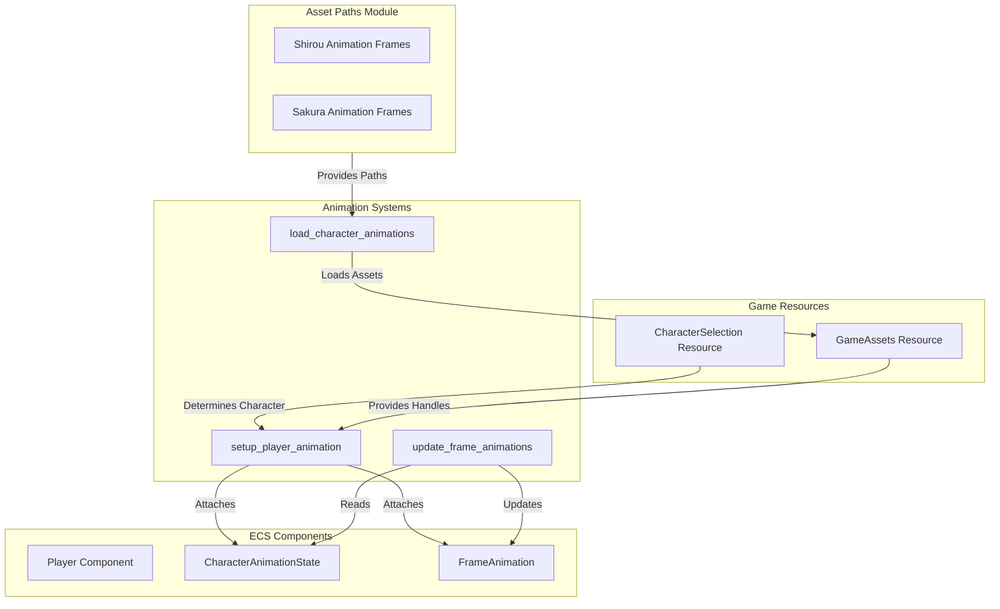

# Design Document: Character Animation System

## Overview

角色动画系统负责管理 Shirou Runner 游戏中 1P 和 2P 玩家的角色动画资源。系统基于 Bevy ECS 架构，通过组件和资源管理角色的动画帧序列，并提供统一的接口供游戏逻辑调用。

核心设计理念：
- **资源集中管理**: 所有动画帧路径在 `asset_paths.rs` 中集中定义
- **玩家角色映射**: 1P 自动使用 Shirou 动画，2P 自动使用 Sakura 动画
- **类型安全**: 使用 Rust 类型系统确保动画资源的正确性
- **可扩展性**: 支持未来添加更多角色和动画状态

## Architecture

### System Architecture


```mermaid
graph TD
    subgraph AssetPaths[Asset Paths Module]
        ShirouPaths[Shirou Animation Frames]
        SakuraPaths[Sakura Animation Frames]
    end
    
    subgraph Resources[Game Resources]
        GameAssets[GameAssets Resource]
        CharSelection[CharacterSelection Resource]
    end
    
    subgraph Components[ECS Components]
        Player[Player Component]
        AnimState[CharacterAnimationState]
        FrameAnim[FrameAnimation]
    end
    
    subgraph Systems[Animation Systems]
        LoadSys[load_character_animations]
        SetupSys[setup_player_animation]
        UpdateSys[update_frame_animations]
    end
    
    AssetPaths -->|Provides Paths| LoadSys
    LoadSys -->|Loads Assets| GameAssets
    CharSelection -->|Determines Character| SetupSys
    GameAssets -->|Provides Handles| SetupSys
    SetupSys -->|Attaches| AnimState
    SetupSys -->|Attaches| FrameAnim
    UpdateSys -->|Updates| FrameAnim
    UpdateSys -->|Reads| AnimState
```

### Module Structure

```
src/
├── asset_paths.rs              # 资源路径常量定义
├── components/
│   ├── animation.rs            # 动画组件定义
│   └── player.rs               # 玩家组件定义
├── resources.rs                # 游戏资源定义
└── systems/
    ├── frame_animation.rs      # 帧动画系统
    └── setup.rs                # 初始化系统
```

## Components and Interfaces

### 1. Asset Path Constants

**Location**: `src/asset_paths.rs`

```rust
// Shirou 动画帧路径常量
pub const IMAGE_CHAR_SHIROU_IDLE1: &str = "images/characters/shirou_idle1.jpg";
pub const IMAGE_CHAR_SHIROU_IDLE2: &str = "images/characters/shirou_idle2.jpg";
// ... 更多帧

// Shirou 动画帧数组
pub const SHIROU_ANIMATION_FRAMES: &[&str] = &[
    IMAGE_CHAR_SHIROU_IDLE1,
    IMAGE_CHAR_SHIROU_IDLE2,
    // ...
];

// Sakura 动画帧路径常量
pub const IMAGE_CHAR_SAKURA_IDLE01: &str = "images/characters/sakura_idle01.png";
// ... 更多帧

// Sakura 动画帧数组
pub const SAKURA_ANIMATION_FRAMES: &[&str] = &[
    IMAGE_CHAR_SAKURA_IDLE01,
    // ...
];
```

**Interface**:
- `SHIROU_ANIMATION_FRAMES: &[&str]` - 返回 Shirou 所有动画帧路径
- `SAKURA_ANIMATION_FRAMES: &[&str]` - 返回 Sakura 所有动画帧路径

### 2. CharacterType Enum

**Location**: `src/states.rs` (已存在)

```rust
#[derive(Debug, Clone, Copy, PartialEq, Eq)]
pub enum CharacterType {
    Shirou1,  // 1P - Shirou
    Shirou2,  // 2P - Sakura (命名保持向后兼容)
}
```

**Methods**:
```rust
impl CharacterType {
    /// 获取角色的动画帧路径数组
    pub fn get_animation_frames(&self) -> &'static [&'static str] {
        match self {
            CharacterType::Shirou1 => asset_paths::SHIROU_ANIMATION_FRAMES,
            CharacterType::Shirou2 => asset_paths::SAKURA_ANIMATION_FRAMES,
        }
    }
    
    /// 获取角色的纹理路径（指定帧索引）
    pub fn get_texture_path(&self, frame_index: usize) -> &'static str {
        let frames = self.get_animation_frames();
        frames.get(frame_index).copied().unwrap_or(frames[0])
    }
}
```

### 3. FrameAnimation Component

**Location**: `src/systems/frame_animation.rs` (已存在，需扩展)

```rust
#[derive(Component, Debug)]
pub struct FrameAnimation {
    pub frames: Vec<Handle<Image>>,
    pub current_frame: usize,
    pub timer: Timer,
    pub is_playing: bool,
    pub loop_animation: bool,
}
```

**Methods**:
```rust
impl FrameAnimation {
    /// 获取当前帧的纹理句柄
    pub fn get_current_texture(&self) -> Option<Handle<Image>> {
        self.frames.get(self.current_frame).cloned()
    }
    
    /// 获取当前帧索引
    pub fn get_current_frame_index(&self) -> usize {
        self.current_frame
    }
}
```

### 4. CharacterAnimationState Component

**Location**: `src/systems/frame_animation.rs` (已存在)

```rust
#[derive(Component, Debug, Clone)]
pub struct CharacterAnimationState {
    pub current_animation: CharacterAnimationType,
    pub idle_frames: Vec<Handle<Image>>,
    pub running_frames: Vec<Handle<Image>>,
    pub jumping_frames: Vec<Handle<Image>>,
    pub crouching_frames: Vec<Handle<Image>>,
}
```

### 5. PlayerNumber Component (新增)

**Location**: `src/components/player.rs`

```rust
/// 玩家编号组件
/// 
/// 用于区分 1P 和 2P 玩家
#[derive(Component, Debug, Clone, Copy, PartialEq, Eq)]
pub enum PlayerNumber {
    Player1,  // 1P - 使用 Shirou
    Player2,  // 2P - 使用 Sakura
}

impl PlayerNumber {
    /// 获取对应的角色类型
    pub fn to_character_type(&self) -> CharacterType {
        match self {
            PlayerNumber::Player1 => CharacterType::Shirou1,
            PlayerNumber::Player2 => CharacterType::Shirou2,
        }
    }
}
```

## Data Models

### Animation Frame Data Structure

```rust
/// 角色动画数据
pub struct CharacterAnimationData {
    /// 角色名称 ("shirou" 或 "sakura")
    pub character_name: String,
    
    /// 动画帧路径列表
    pub frame_paths: Vec<String>,
    
    /// 动画帧句柄（运行时加载）
    pub frame_handles: Vec<Handle<Image>>,
}
```

### Player-Character Mapping

```
1P (PlayerNumber::Player1) -> CharacterType::Shirou1 -> SHIROU_ANIMATION_FRAMES
2P (PlayerNumber::Player2) -> CharacterType::Shirou2 -> SAKURA_ANIMATION_FRAMES
```

## Implementation Details

### 1. Asset Loading System

**System**: `load_character_animations`

**Responsibility**: 在游戏启动时加载所有角色动画帧

**Implementation**:
```rust
pub fn load_character_animations(
    asset_server: Res<AssetServer>,
    mut game_assets: ResMut<GameAssets>,
) {
    // 加载 Shirou 动画帧
    game_assets.shirou_animation_frames = asset_paths::SHIROU_ANIMATION_FRAMES
        .iter()
        .map(|path| asset_server.load(*path))
        .collect();
    
    // 加载 Sakura 动画帧
    game_assets.sakura_animation_frames = asset_paths::SAKURA_ANIMATION_FRAMES
        .iter()
        .map(|path| asset_server.load(*path))
        .collect();
}
```

### 2. Player Animation Setup System

**System**: `setup_player_animation`

**Responsibility**: 为新创建的玩家实体附加动画组件

**Implementation**:
```rust
pub fn setup_player_animation(
    mut commands: Commands,
    player_query: Query<(Entity, &PlayerNumber), (With<Player>, Without<FrameAnimation>)>,
    game_assets: Res<GameAssets>,
) {
    for (entity, player_number) in player_query.iter() {
        let frames = match player_number {
            PlayerNumber::Player1 => game_assets.shirou_animation_frames.clone(),
            PlayerNumber::Player2 => game_assets.sakura_animation_frames.clone(),
        };
        
        let frame_animation = FrameAnimation::new(frames, 0.2, true);
        commands.entity(entity).insert(frame_animation);
    }
}
```

### 3. Animation Update System

**System**: `update_frame_animations`

**Responsibility**: 更新动画帧并切换纹理

**Implementation**: (已存在于 `frame_animation.rs`)

### 4. Texture Path Query Interface

**Helper Function**:
```rust
/// 获取玩家当前动画帧的纹理路径
pub fn get_player_texture_path(
    player_number: PlayerNumber,
    frame_index: usize,
) -> &'static str {
    let character_type = player_number.to_character_type();
    character_type.get_texture_path(frame_index)
}
```

## Testing Strategy

### Unit Tests

测试将位于 `src/tests/animation_tests.rs`

**Test Cases**:
1. **test_character_type_animation_frames**: 验证每个角色类型返回正确的动画帧数组
2. **test_character_type_texture_path**: 验证 `get_texture_path()` 返回正确的路径格式
3. **test_player_number_to_character_mapping**: 验证玩家编号正确映射到角色类型
4. **test_frame_index_bounds**: 验证超出范围的帧索引返回默认帧
5. **test_animation_frame_paths_exist**: 验证所有定义的动画帧路径对应的文件存在

### Property-Based Tests

使用 `proptest` 库进行属性测试。

**Property Tests**:
