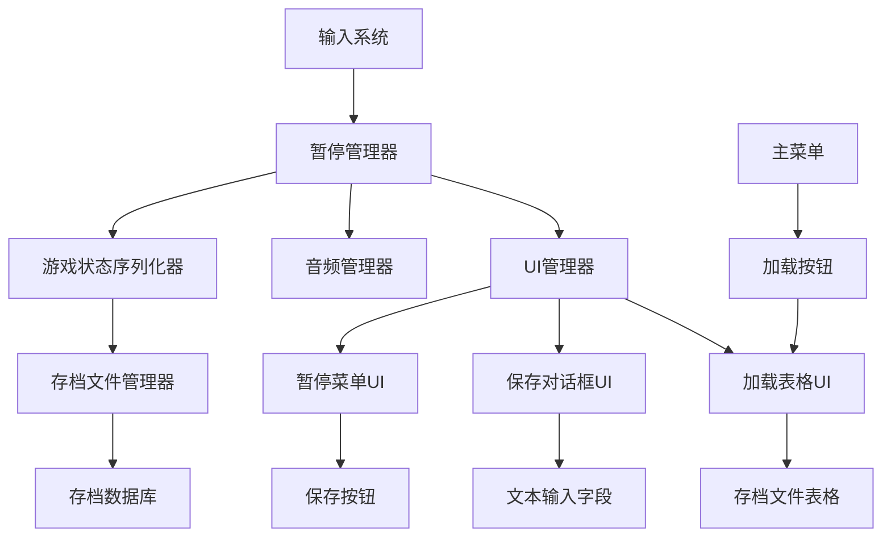

# 设计文档

## 概述

增强暂停和存档系统为士郎跑酷游戏提供全面的游戏状态管理。该系统实现真正的暂停功能，在保持音频连续性的同时保存完整的游戏状态，以及具有自定义命名和表格化存档文件管理的健壮存档/读档系统。该设计与现有的Bevy ECS架构无缝集成，并扩展了当前的状态管理系统。

## 架构

### 系统架构概述



### 状态管理集成

系统扩展现有的 `GameState` 枚举并与当前状态转换集成：

```rust
#[derive(States, Debug, Clone, PartialEq, Eq, Hash, Default)]
pub enum GameState {
    #[default]
    Menu,
    Playing,
    Paused,        // Enhanced with save functionality
    SaveDialog,    // New state for save input
    LoadTable,     // New state for save selection
}
```

### 核心组件架构

- **暂停管理器**: 暂停/恢复操作的中央协调器
- **游戏状态序列化器**: 捕获和恢复完整的游戏状态
- **存档文件管理器**: 处理存档文件操作和元数据
- **UI状态管理器**: 管理UI转换和交互
- **音频状态管理器**: 在暂停期间维持音频连续性

## 组件和接口

### 增强的游戏状态保存

```rust
#[derive(Resource, Serialize, Deserialize, Clone)]
pub struct CompleteGameState {
    // Player state
    pub player_position: Vec3,
    pub player_velocity: Velocity,
    pub player_state: PlayerState,
    pub player_animation: AnimationType,
    
    // Camera state
    pub camera_position: Vec3,
    pub camera_target: Vec3,
    
    // Game metrics
    pub score: u32,
    pub distance_traveled: f32,
    pub jump_count: u32,
    pub play_time: f32,
    
    // Game entities state
    pub entities_state: Vec<EntitySnapshot>,
    
    // Audio state
    pub music_position: f32,
    pub music_playing: bool,
    
    // Character selection
    pub selected_character: CharacterType,
    pub player_count: PlayerCount,
}
```

### Save File Management

```rust
#[derive(Resource)]
pub struct SaveFileManager {
    pub save_directory: String,
    pub save_files: Vec<SaveFileMetadata>,
    pub current_save_name: Option<String>,
}

#[derive(Serialize, Deserialize, Clone)]
pub struct SaveFileMetadata {
    pub name: String,
    pub player_count: PlayerCount,
    pub score: u32,
    pub distance: f32,
    pub play_time: f32,
    pub save_timestamp: DateTime<Utc>,
    pub file_path: String,
}
```

### UI Components

```rust
// Pause Menu Components
#[derive(Component)]
pub struct PauseMenuRoot;

#[derive(Component)]
pub struct SaveGameButton;

#[derive(Component)]
pub struct ResumeButton;

#[derive(Component)]
pub struct MainMenuButton;

// Save Dialog Components
#[derive(Component)]
pub struct SaveDialog;

#[derive(Component)]
pub struct SaveNameInput;

#[derive(Component)]
pub struct ConfirmSaveButton;

#[derive(Component)]
pub struct CancelSaveButton;

// Load Table Components
#[derive(Component)]
pub struct LoadTableRoot;

#[derive(Component)]
pub struct SaveFileRow {
    pub save_index: usize,
}

#[derive(Component)]
pub struct LoadButton;

#[derive(Component)]
pub struct DeleteButton;
```

## Data Models

### Game State Serialization Schema

```rust
#[derive(Serialize, Deserialize)]
pub struct SaveFileData {
    pub version: String,
    pub metadata: SaveFileMetadata,
    pub game_state: CompleteGameState,
    pub checksum: String,
}
```

### Entity State Snapshot

```rust
#[derive(Serialize, Deserialize, Clone)]
pub struct EntitySnapshot {
    pub entity_type: EntityType,
    pub position: Vec3,
    pub velocity: Option<Velocity>,
    pub components: HashMap<String, ComponentData>,
}

#[derive(Serialize, Deserialize, Clone)]
pub enum EntityType {
    Player,
    Ground,
    Obstacle,
    Collectible,
    Effect,
}
```

### Audio State Management

```rust
#[derive(Resource)]
pub struct AudioStateManager {
    pub music_position: f32,
    pub music_volume: f32,
    pub music_playing: bool,
    pub paused_audio_entities: Vec<Entity>,
}
```

### Input State Preservation

```rust
#[derive(Resource, Serialize, Deserialize, Clone)]
pub struct InputStateSnapshot {
    pub input_history: Vec<InputEvent>,
    pub current_inputs: GameInput,
    pub combo_state: Option<ComboType>,
}
```

## Error Handling

### Save Operation Error Handling

```rust
#[derive(Debug)]
pub enum SaveError {
    SerializationFailed(String),
    FileWriteFailed(String),
    InvalidFileName(String),
    DiskSpaceInsufficient,
    PermissionDenied,
}

#[derive(Debug)]
pub enum LoadError {
    FileNotFound(String),
    DeserializationFailed(String),
    CorruptedFile(String),
    VersionMismatch(String),
    ChecksumMismatch,
}
```

### Error Recovery Strategies

1. **Save Failures**: Retry with backup location, show user-friendly error messages
2. **Load Failures**: Graceful fallback to menu, corruption detection and recovery
3. **State Restoration Failures**: Partial state recovery, safe defaults
4. **UI Errors**: Fallback to previous state, error notifications

### Validation and Integrity

```rust
pub struct SaveFileValidator {
    pub supported_versions: Vec<String>,
    pub max_file_size: usize,
    pub required_fields: Vec<String>,
}

impl SaveFileValidator {
    pub fn validate_save_file(&self, data: &SaveFileData) -> Result<(), LoadError>;
    pub fn calculate_checksum(&self, game_state: &CompleteGameState) -> String;
    pub fn verify_integrity(&self, data: &SaveFileData) -> bool;
}
```

## Testing Strategy

### Unit Testing

```rust
#[cfg(test)]
mod tests {
    use super::*;

    #[test]
    fn test_game_state_serialization() {
        // Test complete game state can be serialized and deserialized
    }

    #[test]
    fn test_save_file_validation() {
        // Test save file validation logic
    }

    #[test]
    fn test_pause_resume_state_preservation() {
        // Test that pause/resume maintains exact game state
    }

    #[test]
    fn test_audio_continuity_during_pause() {
        // Test that music continues during pause
    }
}
```

### Integration Testing

```rust
#[test]
fn test_complete_save_load_cycle() {
    // Test saving game state and loading it back
    // Verify all components are restored correctly
}

#[test]
fn test_ui_state_transitions() {
    // Test transitions between game, pause, save dialog, and load table
}

#[test]
fn test_error_handling_scenarios() {
    // Test various error conditions and recovery
}
```

### Performance Testing

- **Save Operation Performance**: Target < 100ms for save operations
- **Load Operation Performance**: Target < 200ms for load operations
- **Memory Usage**: Monitor memory overhead of state preservation
- **UI Responsiveness**: Ensure UI remains responsive during operations

## Technical Implementation Details

### Pause System Implementation

```rust
pub struct PauseManager {
    pub paused_systems: Vec<SystemId>,
    pub preserved_state: Option<CompleteGameState>,
    pub pause_timestamp: Option<Instant>,
}

impl PauseManager {
    pub fn pause_game(&mut self, world: &mut World) -> Result<(), PauseError>;
    pub fn resume_game(&mut self, world: &mut World) -> Result<(), PauseError>;
    pub fn is_paused(&self) -> bool;
}
```

### Save System Implementation

```rust
pub struct SaveSystem;

impl SaveSystem {
    pub fn capture_game_state(world: &World) -> CompleteGameState;
    pub fn restore_game_state(world: &mut World, state: CompleteGameState);
    pub fn save_to_file(state: &CompleteGameState, filename: &str) -> Result<(), SaveError>;
    pub fn load_from_file(filename: &str) -> Result<CompleteGameState, LoadError>;
}
```

### UI System Implementation

```rust
pub struct EnhancedUIManager {
    pub current_ui_state: UIState,
    pub ui_stack: Vec<UIState>,
    pub input_buffer: String,
}

#[derive(Debug, Clone, PartialEq)]
pub enum UIState {
    Game,
    PauseMenu,
    SaveDialog,
    LoadTable,
}
```

## Localization and Accessibility

### English Text Implementation

All UI text will be implemented in English to avoid encoding issues:

```rust
pub struct UIText;

impl UIText {
    pub const PAUSE_TITLE: &'static str = "Game Paused";
    pub const SAVE_BUTTON: &'static str = "Save Game";
    pub const LOAD_BUTTON: &'static str = "Load Game";
    pub const RESUME_BUTTON: &'static str = "Resume";
    pub const MAIN_MENU_BUTTON: &'static str = "Main Menu";
    pub const SAVE_NAME_PROMPT: &'static str = "Enter save name:";
    pub const CONFIRM_SAVE: &'static str = "Confirm";
    pub const CANCEL: &'static str = "Cancel";
    
    // Table headers
    pub const SAVE_NAME_HEADER: &'static str = "Save Name";
    pub const PLAYER_COUNT_HEADER: &'static str = "Players";
    pub const SCORE_HEADER: &'static str = "Score";
    pub const DISTANCE_HEADER: &'static str = "Distance";
    pub const TIME_HEADER: &'static str = "Time";
    pub const DATE_HEADER: &'static str = "Date";
}
```

### Accessibility Features

- **Keyboard Navigation**: Full keyboard support for all UI elements
- **Clear Visual Hierarchy**: Consistent button styling and layout
- **Error Messages**: Clear, actionable error messages
- **Progress Indicators**: Visual feedback for save/load operations

## Performance Considerations

### Memory Management

- **State Snapshots**: Efficient serialization to minimize memory usage
- **UI Caching**: Reuse UI elements where possible
- **Cleanup**: Proper cleanup of temporary UI states

### File I/O Optimization

- **Async Operations**: Non-blocking save/load operations
- **Compression**: Optional compression for save files
- **Batch Operations**: Efficient handling of multiple save files

### System Scheduling

```rust
// System sets for proper ordering
#[derive(SystemSet, Debug, Hash, PartialEq, Eq, Clone)]
pub enum PauseSystemSet {
    Input,
    StateCapture,
    UIUpdate,
    AudioManagement,
}
```

## Security and Data Integrity

### Save File Security

- **Checksum Validation**: Prevent save file tampering
- **Version Control**: Handle save file format changes
- **Backup System**: Automatic backup of save files

### Error Recovery

- **Graceful Degradation**: Partial state recovery when possible
- **Safe Defaults**: Fallback to safe game states
- **User Notification**: Clear communication of any issues