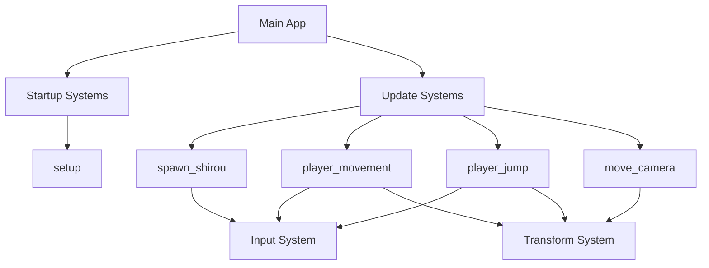

# Design Document

## Overview

Shirou Runner 是一个基于 Bevy 引擎的 2D 横版跑酷游戏。游戏采用 Entity Component System (ECS) 架构，通过组件化设计实现角色控制、物理模拟、摄像机跟随等核心功能。游戏以简洁的几何图形表示游戏对象，专注于流畅的游戏机制而非复杂的视觉效果。

## Architecture

### Core Systems Architecture



### Entity Component System Design

- **Entities**: 游戏对象的唯一标识符
  - Player Entity: 士郎角色实体
  - Ground Entity: 地面实体
  - Camera Entity: 摄像机实体

- **Components**: 数据容器
  - `Player`: 标记组件，标识玩家角色
  - `Velocity`: 速度组件，包含 x 和 y 方向速度
  - `Transform`: Bevy 内置变换组件
  - `Sprite`: Bevy 内置精灵组件
  - `Camera`: Bevy 内置摄像机组件

- **Systems**: 逻辑处理器
  - 启动系统：初始化游戏场景
  - 更新系统：处理游戏逻辑

## Components and Interfaces

### Player Component
```rust
#[derive(Component)]
struct Player;
```
- 用途：标记玩家控制的角色实体
- 类型：标记组件（无数据）

### Velocity Component
```rust
#[derive(Component)]
struct Velocity {
    x: f32,
    y: f32,
}
```
- 用途：存储实体的速度信息
- 字段：
  - `x`: 水平方向速度
  - `y`: 垂直方向速度

### Input Handling Interface
- 输入类型：`ButtonInput<KeyCode>`
- 支持的按键：
  - 移动：A/D 键，左/右箭头键
  - 跳跃：W 键，上箭头键
  - 生成角色：空格键

### Transform Interface
- 位置：`Vec3` 坐标系统
- 地面高度：y = -240.0
- 初始玩家位置：(-400.0, -240.0, 1.0)
- 地面位置：(0.0, -300.0, 0.0)

## Data Models

### Game World Coordinate System
- 坐标系：2D 笛卡尔坐标系
- 单位：像素
- 原点：屏幕中心
- Y 轴：向上为正
- X 轴：向右为正

### Physics Constants
```rust
const GRAVITY: f32 = 800.0;           // 重力加速度
const JUMP_VELOCITY: f32 = 400.0;     // 跳跃初始速度
const MOVE_SPEED: f32 = 250.0;        // 水平移动速度
const GROUND_LEVEL: f32 = -240.0;     // 地面高度
const CAMERA_FOLLOW_SPEED: f32 = 2.0; // 摄像机跟随速度
const CAMERA_OFFSET: f32 = 200.0;     // 摄像机偏移距离
```

### Visual Properties
```rust
// 玩家角色
const PLAYER_COLOR: Color = Color::srgb(1.0, 0.4, 0.2); // 橙红色
const PLAYER_SIZE: Vec2 = Vec2::new(40.0, 60.0);

// 地面
const GROUND_COLOR: Color = Color::srgb(0.3, 0.3, 0.3); // 灰色
const GROUND_SIZE: Vec2 = Vec2::new(2000.0, 50.0);
```

## Error Handling

### Input Error Handling
- **无效输入**：系统忽略未定义的按键输入
- **重复生成**：检查现有玩家实体，防止重复生成
- **查询失败**：使用 `Ok()` 模式匹配处理查询结果

### Physics Error Handling
- **地面穿透**：强制重置角色位置到地面高度
- **速度溢出**：通过地面碰撞检测重置垂直速度
- **时间增量异常**：使用 Bevy 的稳定时间系统

### System Error Handling
- **实体不存在**：使用 `Query::single_mut()` 的 Result 类型
- **组件缺失**：通过类型系统在编译时保证组件存在
- **系统依赖**：明确定义系统执行顺序

## Testing Strategy

### Unit Testing
- **组件测试**：验证组件数据结构的正确性
- **系统逻辑测试**：测试各个系统的核心逻辑
- **物理计算测试**：验证重力、跳跃、移动的数学计算

### Integration Testing
- **输入响应测试**：验证输入事件到角色动作的完整流程
- **系统协作测试**：测试多个系统间的数据传递和状态同步
- **场景初始化测试**：验证游戏启动时的场景设置

### Performance Testing
- **帧率稳定性**：确保游戏在目标帧率下稳定运行
- **内存使用**：监控实体和组件的内存占用
- **系统效率**：测量各系统的执行时间

### User Experience Testing
- **操作响应性**：验证输入延迟在可接受范围内
- **视觉流畅性**：确保摄像机跟随和角色移动的平滑性
- **游戏平衡性**：调整物理参数以获得最佳游戏体验

## Technical Considerations

### Bevy Version Compatibility
- 目标版本：Bevy 0.16
- 关键 API 变更：
  - `Input<KeyCode>` → `ButtonInput<KeyCode>`
  - `SpriteBundle` → 直接使用 `Sprite` 组件
  - `Camera2dBundle` → `Camera2d`
  - `Color::rgb()` → `Color::srgb()`
  - `delta_seconds()` → `delta_secs()`

### Performance Optimization
- 使用 ECS 架构提高缓存效率
- 避免不必要的实体查询
- 合理使用系统并行执行
- 优化编译配置以提高开发效率

### Extensibility Design
- 组件化设计便于添加新功能
- 系统模块化便于功能扩展
- 清晰的接口定义便于维护
- 配置化的游戏参数便于调整