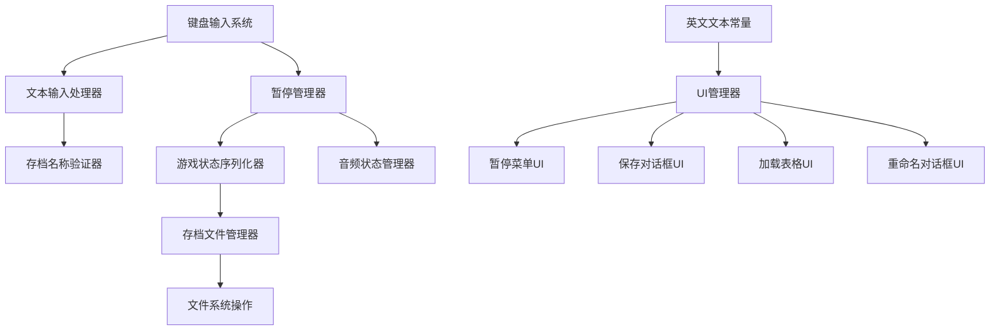

# 统一存档系统设计文档

## 概述

统一存档系统为士郎跑酷游戏提供完整的游戏状态管理解决方案。该系统修复了现有的文本输入问题，实现了真正的暂停功能，提供了健壮的存档/读档系统，并确保所有界面使用英文显示。设计与现有的Bevy ECS架构无缝集成，扩展了当前的状态管理系统。

## 架构

### 系统架构概述



### 状态管理集成

系统扩展现有的 `GameState` 枚举：

```rust
#[derive(States, Debug, Clone, PartialEq, Eq, Hash, Default)]
pub enum GameState {
    #[default]
    Menu,
    Playing,
    Paused,        // 增强的暂停状态
    SaveDialog,    // 存档对话框状态
    LoadTable,     // 加载表格状态
    RenameDialog,  // 重命名对话框状态
}
```

## 组件和接口

### 1. 修复的文本输入系统

```rust
#[derive(Resource, Default)]
pub struct TextInputState {
    pub current_text: String,
    pub is_active: bool,
    pub cursor_position: usize,
    pub max_length: usize,
    pub allowed_chars: HashSet<char>,
}

#[derive(Resource, Default)]
pub struct KeyboardInputHandler {
    pub input_buffer: Vec<KeyCode>,
    pub last_input_time: f32,
    pub repeat_delay: f32,
}
```

### 2. 增强的游戏状态保存

```rust
#[derive(Resource, Serialize, Deserialize, Clone)]
pub struct CompleteGameState {
    // 玩家状态
    pub player_position: Vec3,
    pub player_velocity: Velocity,
    pub player_state: PlayerState,
    pub player_animation: AnimationType,
    
    // 摄像机状态
    pub camera_position: Vec3,
    pub camera_target: Vec3,
    
    // 游戏指标
    pub score: u32,
    pub distance_traveled: f32,
    pub jump_count: u32,
    pub play_time: f32,
    
    // 游戏实体状态
    pub entities_state: Vec<EntitySnapshot>,
    
    // 音频状态
    pub music_position: f32,
    pub music_playing: bool,
    pub audio_volume: f32,
    
    // 角色选择
    pub selected_character: CharacterType,
    pub player_count: PlayerCount,
    
    // 时间戳
    pub save_timestamp: DateTime<Utc>,
}
```

### 3. 存档文件管理

```rust
#[derive(Resource, Default)]
pub struct SaveFileManager {
    pub save_directory: PathBuf,
    pub save_files: Vec<SaveFileMetadata>,
    pub current_save_name: Option<String>,
    pub selected_save_index: Option<usize>,
}

#[derive(Serialize, Deserialize, Clone)]
pub struct SaveFileMetadata {
    pub name: String,
    pub player_count: PlayerCount,
    pub score: u32,
    pub distance: f32,
    pub play_time: f32,
    pub save_timestamp: DateTime<Utc>,
    pub file_path: PathBuf,
    pub file_size: u64,
}
```

### 4. 英文文本常量

```rust
pub struct UnifiedSaveText {
    // 主菜单
    pub const MAIN_MENU_LOAD: &'static str = "Load Game";
    
    // 暂停菜单
    pub const PAUSE_TITLE: &'static str = "Game Paused";
    pub const PAUSE_SAVE: &'static str = "Save Game";
    pub const PAUSE_RESUME: &'static str = "Resume";
    pub const PAUSE_MAIN_MENU: &'static str = "Main Menu";
    
    // 保存对话框
    pub const SAVE_DIALOG_TITLE: &'static str = "Save Game";
    pub const SAVE_NAME_PROMPT: &'static str = "Enter save name:";
    pub const SAVE_CONFIRM: &'static str = "Save";
    pub const SAVE_CANCEL: &'static str = "Cancel";
    pub const SAVE_SUCCESS: &'static str = "Game saved successfully!";
    
    // 加载表格
    pub const LOAD_TABLE_TITLE: &'static str = "Load & Manage Saves";
    pub const LOAD_NAME_HEADER: &'static str = "Name";
    pub const LOAD_PLAYERS_HEADER: &'static str = "Players";
    pub const LOAD_SCORE_HEADER: &'static str = "Score";
    pub const LOAD_DISTANCE_HEADER: &'static str = "Distance";
    pub const LOAD_TIME_HEADER: &'static str = "Time";
    pub const LOAD_DATE_HEADER: &'static str = "Date";
    pub const LOAD_ACTIONS_HEADER: &'static str = "Actions";
    pub const LOAD_BUTTON: &'static str = "Load";
    pub const RENAME_BUTTON: &'static str = "Rename";
    pub const DELETE_BUTTON: &'static str = "Delete";
    pub const REFRESH_BUTTON: &'static str = "Refresh";
    pub const BACK_BUTTON: &'static str = "Back";
    pub const NO_SAVES_MESSAGE: &'static str = "No save files found";
    
    // 重命名对话框
    pub const RENAME_DIALOG_TITLE: &'static str = "Rename Save";
    pub const RENAME_PROMPT: &'static str = "Enter new name:";
    pub const RENAME_CONFIRM: &'static str = "Rename";
    pub const RENAME_CANCEL: &'static str = "Cancel";
    
    // 错误消息
    pub const ERROR_SAVE_FAILED: &'static str = "Failed to save game";
    pub const ERROR_LOAD_FAILED: &'static str = "Failed to load game";
    pub const ERROR_DELETE_FAILED: &'static str = "Failed to delete save";
    pub const ERROR_RENAME_FAILED: &'static str = "Failed to rename save";
    pub const ERROR_CORRUPTED_FILE: &'static str = "Save file is corrupted";
    pub const ERROR_FILE_NOT_FOUND: &'static str = "Save file not found";
    pub const ERROR_PERMISSION_DENIED: &'static str = "Permission denied";
}
```

### 5. UI组件

```rust
// 暂停菜单组件
#[derive(Component)]
pub struct PauseMenuRoot;

#[derive(Component)]
pub struct SaveGameButton;

#[derive(Component)]
pub struct ResumeButton;

#[derive(Component)]
pub struct MainMenuButton;

// 保存对话框组件
#[derive(Component)]
pub struct SaveDialog;

#[derive(Component)]
pub struct SaveNameInputBox;

#[derive(Component)]
pub struct SaveConfirmButton;

#[derive(Component)]
pub struct SaveCancelButton;

// 加载表格组件
#[derive(Component)]
pub struct LoadTableRoot;

#[derive(Component)]
pub struct SaveFileRow {
    pub save_index: usize,
}

#[derive(Component)]
pub struct LoadSaveButton {
    pub save_index: usize,
}

#[derive(Component)]
pub struct RenameSaveButton {
    pub save_index: usize,
}

#[derive(Component)]
pub struct DeleteSaveButton {
    pub save_index: usize,
}

// 重命名对话框组件
#[derive(Component)]
pub struct RenameDialog;

#[derive(Component)]
pub struct RenameInputBox;

#[derive(Component)]
pub struct RenameConfirmButton;

#[derive(Component)]
pub struct RenameCancelButton;
```

## 数据模型

### 存档文件数据结构

```rust
#[derive(Serialize, Deserialize)]
pub struct SaveFileData {
    pub version: String,
    pub metadata: SaveFileMetadata,
    pub game_state: CompleteGameState,
    pub checksum: String,
}

#[derive(Serialize, Deserialize, Clone)]
pub struct EntitySnapshot {
    pub entity_type: EntityType,
    pub position: Vec3,
    pub velocity: Option<Velocity>,
    pub components: HashMap<String, ComponentData>,
}

#[derive(Serialize, Deserialize, Clone)]
pub enum EntityType {
    Player,
    Ground,
    Obstacle,
    Collectible,
    Effect,
    Camera,
}
```

### 输入验证

```rust
pub struct InputValidator {
    pub max_length: usize,
    pub allowed_chars: HashSet<char>,
    pub reserved_names: HashSet<String>,
}

impl InputValidator {
    pub fn validate_save_name(&self, name: &str) -> Result<String, ValidationError>;
    pub fn sanitize_input(&self, input: &str) -> String;
    pub fn is_valid_char(&self, c: char) -> bool;
}

#[derive(Debug)]
pub enum ValidationError {
    TooLong,
    InvalidCharacters,
    ReservedName,
    Empty,
}
```

## 错误处理

### 错误类型定义

```rust
#[derive(Debug)]
pub enum SaveSystemError {
    // 文件操作错误
    FileNotFound(String),
    PermissionDenied(String),
    DiskSpaceInsufficient,
    FileCorrupted(String),
    
    // 序列化错误
    SerializationFailed(String),
    DeserializationFailed(String),
    
    // 验证错误
    InvalidFileName(String),
    ChecksumMismatch,
    VersionMismatch(String),
    
    // 输入错误
    TextInputFailed(String),
    KeyboardInputError(String),
}

impl SaveSystemError {
    pub fn to_user_message(&self) -> &'static str {
        match self {
            SaveSystemError::FileNotFound(_) => UnifiedSaveText::ERROR_FILE_NOT_FOUND,
            SaveSystemError::PermissionDenied(_) => UnifiedSaveText::ERROR_PERMISSION_DENIED,
            SaveSystemError::FileCorrupted(_) => UnifiedSaveText::ERROR_CORRUPTED_FILE,
            _ => "An unexpected error occurred",
        }
    }
}
```

### 错误恢复策略

```rust
pub struct ErrorRecoveryManager {
    pub retry_attempts: HashMap<String, u32>,
    pub max_retries: u32,
    pub backup_directory: PathBuf,
}

impl ErrorRecoveryManager {
    pub fn handle_save_error(&mut self, error: SaveSystemError) -> RecoveryAction;
    pub fn handle_load_error(&mut self, error: SaveSystemError) -> RecoveryAction;
    pub fn create_backup(&self, save_name: &str) -> Result<(), SaveSystemError>;
    pub fn restore_from_backup(&self, save_name: &str) -> Result<(), SaveSystemError>;
}

pub enum RecoveryAction {
    Retry,
    UseBackup,
    ShowError(String),
    ReturnToMenu,
}
```

## 测试策略

### 单元测试

```rust
#[cfg(test)]
mod tests {
    use super::*;

    #[test]
    fn test_text_input_processing() {
        // 测试键盘输入处理
    }

    #[test]
    fn test_save_name_validation() {
        // 测试存档名称验证
    }

    #[test]
    fn test_game_state_serialization() {
        // 测试游戏状态序列化
    }

    #[test]
    fn test_file_operations() {
        // 测试文件操作
    }

    #[test]
    fn test_english_text_constants() {
        // 测试英文文本常量
    }
}
```

### 集成测试

```rust
#[test]
fn test_complete_save_load_cycle() {
    // 测试完整的保存-加载循环
}

#[test]
fn test_pause_resume_functionality() {
    // 测试暂停-恢复功能
}

#[test]
fn test_ui_state_transitions() {
    // 测试UI状态转换
}

#[test]
fn test_error_handling_scenarios() {
    // 测试错误处理场景
}
```

## 性能考虑

### 内存管理

- **状态快照**: 高效序列化以最小化内存使用
- **UI缓存**: 尽可能重用UI元素
- **清理**: 临时UI状态的适当清理

### 文件I/O优化

- **异步操作**: 非阻塞的保存/加载操作
- **压缩**: 存档文件的可选压缩
- **批处理操作**: 高效处理多个存档文件

### 系统调度

```rust
#[derive(SystemSet, Debug, Hash, PartialEq, Eq, Clone)]
pub enum UnifiedSaveSystemSet {
    Input,
    TextProcessing,
    StateCapture,
    FileOperations,
    UIUpdate,
    AudioManagement,
    ErrorHandling,
}
```

## 安全性和数据完整性

### 存档文件安全

```rust
pub struct SaveFileValidator {
    pub supported_versions: Vec<String>,
    pub max_file_size: usize,
    pub checksum_algorithm: ChecksumType,
}

impl SaveFileValidator {
    pub fn validate_save_file(&self, data: &SaveFileData) -> Result<(), SaveSystemError>;
    pub fn calculate_checksum(&self, game_state: &CompleteGameState) -> String;
    pub fn verify_integrity(&self, data: &SaveFileData) -> bool;
    pub fn migrate_old_format(&self, old_data: &str) -> Result<SaveFileData, SaveSystemError>;
}
```

### 备份系统

```rust
pub struct BackupManager {
    pub backup_directory: PathBuf,
    pub max_backups: usize,
    pub auto_backup_enabled: bool,
}

impl BackupManager {
    pub fn create_backup(&self, save_name: &str) -> Result<(), SaveSystemError>;
    pub fn restore_backup(&self, save_name: &str) -> Result<(), SaveSystemError>;
    pub fn cleanup_old_backups(&self) -> Result<(), SaveSystemError>;
}
```

## 实现细节

### 键盘输入处理

```rust
pub fn handle_keyboard_input(
    mut keyboard_input: ResMut<Input<KeyCode>>,
    mut text_input_state: ResMut<TextInputState>,
    mut char_input_events: EventReader<ReceivedCharacter>,
) {
    // 处理字符输入
    for event in char_input_events.iter() {
        if text_input_state.is_active {
            let c = event.char;
            if text_input_state.is_valid_char(c) && 
               text_input_state.current_text.len() < text_input_state.max_length {
                text_input_state.current_text.push(c.to_uppercase().next().unwrap_or(c));
            }
        }
    }
    
    // 处理特殊键
    if keyboard_input.just_pressed(KeyCode::Back) && text_input_state.is_active {
        text_input_state.current_text.pop();
    }
    
    if keyboard_input.just_pressed(KeyCode::Return) && text_input_state.is_active {
        // 确认输入
    }
    
    if keyboard_input.just_pressed(KeyCode::Escape) && text_input_state.is_active {
        // 取消输入
    }
}
```

### 暂停系统实现

```rust
pub fn handle_pause_input(
    keyboard_input: Res<Input<KeyCode>>,
    current_state: Res<State<GameState>>,
    mut next_state: ResMut<NextState<GameState>>,
    mut pause_manager: ResMut<PauseManager>,
    world: &mut World,
) {
    if keyboard_input.just_pressed(KeyCode::Escape) {
        match current_state.get() {
            GameState::Playing => {
                pause_manager.capture_game_state(world);
                next_state.set(GameState::Paused);
            }
            GameState::Paused => {
                pause_manager.restore_game_state(world);
                next_state.set(GameState::Playing);
            }
            _ => {}
        }
    }
}
```

这个统一的设计文档整合了两个原始规格的所有功能，提供了一个完整、健壮的存档系统解决方案。